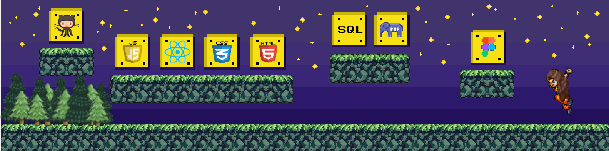

<h1>🚀Building cool stuff with code & curiosity</h1>

  

<ul>
<h2  style="display: inline-block;">Hello!</h2>  

</ul>

---

<ul list-style-type: none;>
<li>🌱 What I’m working on: currently a software engineering student</li>
<li>🔭 Building <a href="https://github.com/KarynaMisnik/horror-shelf">Horror Shelf</a>, <a href="https://github.com/KarynaMisnik/coat-of-arms">Coat of Arms</a></li>
<li>📚 Deep diving into Javascript</li>
<li>⚡ Fun fact: I like assembling IKEA furniture
</li>
</ul>

---

 
 <ul>
 <h2  style="display: inline-block;"><h2> 🛠️ My Toolbox:</h2>
</ul>

<table>
 <thead>
  <tr>
   <th>Category</th>
   <th>Skills</th>
  </tr>
 </thead>
 <tbody>
  <tr>
   <td>Design</td>
   <td></td>
  </tr>
    <tr>
   <td>Languages</td>
   <td></td>    
  </tr>
      <tr>
   <td>Fronted</td>
   <td></td>
  </tr>
    </tr>
      <tr>
   <td>Other</td>
   <td></td>
  </tr>
 </tbody>
</table>

 

⊂(｡･ω･｡)つ ━✩₊✰.⋆☾⋆✧⋆｡ °✩ ₊‧⁺˖⋆༺✩ ₊⋆☆⋆☾☆༺⋆☆⋆☾☆༺⋆
